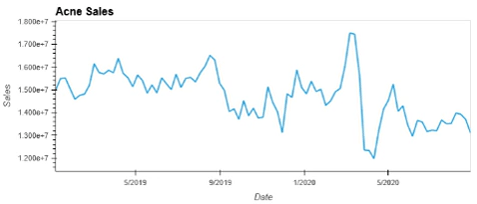
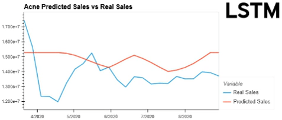

# Project 2

# 
 Retail, Machine Learning, and the Power of Sales 

  
 How to predict sales and quanitfy results using machine learning . 

## Premise
We have been hired by a Wal-Mart competitor to determine the best sales strategy and pricing for in-store tolietry projects. So by running the data provided to us through machine learning (ARIMA, LTSM, SARIMA, SVR) we will be able to provide an answer on what items sell best win, what items are most effected by sales promotions and the best way to allocate resources. 

## **DATA**
**Data Origin**
* Data provided by an E-commerce company. 

**Data Included**
| Years  | Type of Data  |
| ------------- | ------------- |
| 2019-2021 |  Sales Data  |
| 2019-2020 | Promotion Campaign Data  | 
  * Data compiled from 5 Major Retailers in the United States.

**Cleaning Data**
 * Data condensed into 9 categories 
  * Acne, Bath, Body Wash, Hair, Lotion, Makeup, Shaving, Sunscreen, Tanner
 * Removed 2021 Sales Data as we did not have corresponding promotional data to use with it.
 * Combined Sales Data and Promotional Data into one .csv file. e
 * Further Data Cleaning such as changing column names and transposing was accomplished in our program.    

Finalised Data: [Sales & Promotional Data 2019/20](Data/sales_promo_data_19_20.csv)

## Process
* Decompose the data in order to detect the trends in it. See if it is additive or mutiplicative. 
* Used Three Main Types of Machine Learning 
  * ARIMA
  * LTSM
  * SVR 
* ARIMA 
* SVR is used to try to establish if there is any link between a specific week of the year and sales in any of our three ideas. 
* In our models we kept to 6 as our window and ran 10 Epochs when building the LSTM models. After experimentation we felt this gave us the best results.   

## Analysis
* Single images and what they mean.

## GIFs of Data & Dashboard
* Place to put Dashboard/GIFs whenever we design it. 

## Conclusion
### Program
* The Code worked to our expectations. While some data had to be cleaned properly to make sure that the Machine Learning" parts were fed good data everything held up and all the different types of machine learning we ran the info through painted the same general picture. 
* We believe that it would be easy to scale the program up to a larger size, or plug and play with any sort of information that you have.  

### Results
* All three of the items that we closely studied were affected by the COVID-19 Lockdowns of 2020. 
* The drastic drop in sales during the COVID-19 lockdown did affect our models, as we can see with the LSTM the predicted sales were consistently above the actual sales, but both sales did follow closely on the same trend lines. 
* ARIMA model followed the actual sales the closest in the prediction mode. 
* There is no seasonality with Acne or Makeup products, there is slight seasonality with Lotion.
* Promotions were the most effective for Lotion and not very effective  for Makeup. 
* Even with Lotion having more seasonality than the other you still cannot know for certain what level of sales there will be in a specific week of the year.  

## Project Worked on By
* [William Brooks](https://github.com/Wil-bro0824)
* [Jon Iadonisi](https://github.com/Jfrog242)
* [Benjamin McCright](https://github.com/BenMcCright)
* [David Ready](https://github.com/CrusadingGroundhog)
